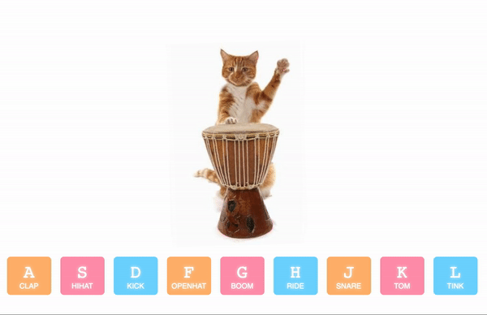

# TomcatDrumJS

Creative coding with JavaScript to create a drumkit with keyboard input for sounds.

Based off of lesson #2 of <a href="https://javascript30.com/">JavaScript30</a>, Wes Bos's 30 Day Vanilla JS Coding Challenge.

### Features:
- CSS variables for colour-picker
- JS for updating CSS variables
- JS for updating clock hand rotation based on local time.

